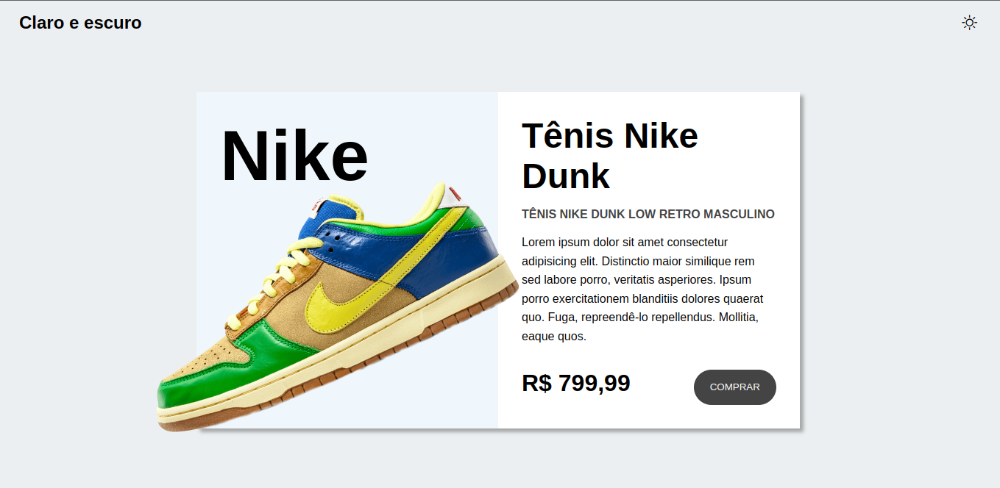
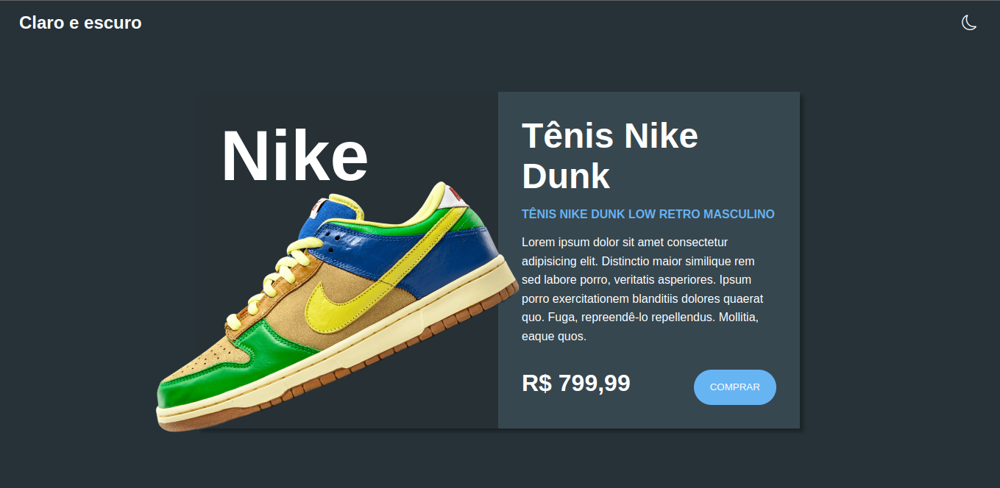

# Theme Dark

O projeto foi criado com o propósito de estudo e para treinar HTML, CSS, JS. :man_technologist:

O projeto foi criado através da (vídeo) aula do Matheus Battisti - Hora de Codar. o link para o vídeo no YouTube: [vídeo aula](https://www.youtube.com/watch?v=i1dNnS6pXAo)

O projeto também inclui uma parte de localStorage, onde consiste em armazenar dados no navegador, se o usuário por o tema escuro e sair da página, assim que ele voltar, a pagina ainda vai está com o tema aplicado por ele.

# Interfaces

